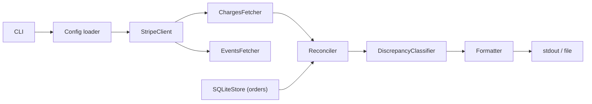

# Stripe Billing Reconciler

  

> Reconcile Stripe charges and subscriptions against your internal orders table — cursor-paginated, idempotent, rate-limit-aware, and auditable.

CLI tool written in Python — chosen for scripting ergonomics and Stripe SDK maturity — that fetches Stripe charge and subscription events via cursor-based pagination, cross-references them against a local orders table (columns: order_id TEXT, amount_cents INTEGER, stripe_charge_id TEXT, created_at TIMESTAMP), and outputs a structured discrepancy re

## Table of contents

- [About](#about)
- [Tech](#tech)
- [Installation](#installation)
- [Usage](#usage)
- [Architecture](#architecture)
- [Contributing](#contributing)
- [License](#license)

## About

CLI tool written in Python — chosen for scripting ergonomics and Stripe SDK maturity — that fetches Stripe charge and subscription events via cursor-based pagination, cross-references them against a local orders table (columns: order_id TEXT, amount_cents INTEGER, stripe_charge_id TEXT, created_at TIMESTAMP), and outputs a structured discrepancy re

**What this demonstrates**

- Cursor-based pagination over Stripe Events API with auto-resume on interrupted runs via SQLite checkpoint table
- Token-bucket rate limiter to stay within Stripe's 100 req/s limit without 429 errors
- Idempotent rerun via checkpoint table storing last-processed event cursor in SQLite
- Discrepancy classification engine with configurable tolerance window operating against a typed orders schema (order_id, amount_cents, stripe_charge_id, created_at)
- Structured JSON logging with per-run correlation IDs for auditability
- Full static analysis pipeline: mypy strict-mode type checking + ruff linting + pytest ≥85% line coverage enforced in GitHub Actions CI on every push

## Tech

Python · Stripe SDK · SQLite · Click · pytest · mypy · ruff · GitHub Actions

## Installation

```bash
git clone https://github.com/Hauckjf/stripe-billing-reconciler.git
cd stripe-billing-reconciler
# install dependencies
```

## Usage

Set your Stripe API key before running:

```bash
export STRIPE_API_KEY=sk_test_...
```

Any [Stripe test-mode key](https://dashboard.stripe.com/test/apikeys) works; no live charges are made.

### Example 1: reconcile a date window

```bash
stripe-reconcile reconcile \
  --from-date 2024-01-01 \
  --to-date   2024-01-31 \
  --csv       examples/orders.csv \
  --format    json
```

Expected output (truncated to 2 discrepancy objects; exit code `1` because discrepancies were found):

```json
[
  {
    "kind": "AMOUNT_MISMATCH",
    "charge_id": "ch_1A2b3C4d5E6f",
    "order_id": "ord_1001",
    "stripe_amount_cents": 5000,
    "order_amount_cents": 4999,
    "detail": "order ord_1001 expects 4999 cents, Stripe reports 5000 cents (delta: +1)"
  },
  {
    "kind": "CHARGE_NOT_IN_ORDERS",
    "charge_id": "ch_9Z8y7X6w5V4u",
    "order_id": null,
    "stripe_amount_cents": 2500,
    "order_amount_cents": null,
    "detail": "Stripe charge 'ch_9Z8y7X6w5V4u' has no matching local order"
  }
]
```

Exit code is `0` when no discrepancies are found; `1` when at least one is detected.

### Example 2: pipe into jq for summary

```bash
stripe-reconcile reconcile \
  --csv    examples/orders.csv \
  --format json \
| jq '[.[] | .kind] | group_by(.) | map({kind: .[0], count: length})'
```

Expected output:

```json
[
  {
    "kind": "AMOUNT_MISMATCH",
    "count": 1
  },
  {
    "kind": "CHARGE_NOT_IN_ORDERS",
    "count": 3
  }
]
```

### All options

| Flag | Default | Description |
|------|---------|-------------|
| `--from-date DATE` | — | Start of the reconciliation window, inclusive (ISO 8601, e.g. `2024-01-01`). Omit to include all charges from the beginning of your Stripe history. |
| `--to-date DATE` | — | End of the reconciliation window, inclusive (ISO 8601, e.g. `2024-01-31`). Omit to include charges up to the current timestamp. |
| `--csv PATH` | — | Load orders from a CSV file (columns: `order_id`, `amount_cents`, `stripe_charge_id`, `created_at`) into a fresh SQLite database before reconciling. |
| `--db PATH` | `./orders.db` | Path to an existing SQLite database containing the `orders` table. Ignored when `--csv` is provided. |
| `--format FORMAT` | `json` | Output format: `json` (pretty-printed array), `csv` (header + one row per discrepancy), or `table` (rich ASCII table). |
| `--output PATH` | stdout | Write the report to a file instead of stdout. |

## Architecture



The CLI parses flags and loads configuration (API key, date range, tolerance), then initialises a shared `StripeClient` that enforces the token-bucket rate limiter on every outbound request. `ChargesFetcher` and `EventsFetcher` pull Stripe data in cursor-paginated batches, checkpointing each cursor to SQLite so an interrupted run resumes exactly where it left off; simultaneously, `SQLiteStore` surfaces the internal orders rows for cross-referencing. The `Reconciler` joins Stripe records against orders by `stripe_charge_id`, then `DiscrepancyClassifier` buckets each pair into `matched`, `amount_mismatched`, or `unmatched` before `Formatter` serialises the final report to stdout or a file path.

Architectural decision records live in [`docs/adr/`](docs/adr/).

## Definition of done

- Fetches all charges and subscription invoices for a configurable date range using cursor pagination; resumes an interrupted run from the last SQLite checkpoint without reprocessing already-seen events.
- Respects Stripe rate limits via token-bucket throttler; no 429 responses observed when running against a Stripe test-mode account with default concurrency settings.
- Orders table contract: tool expects columns order_id TEXT, amount_cents INTEGER, stripe_charge_id TEXT, created_at TIMESTAMP; accepts an alternate table name via --schema flag; a migrations script is included to create the table from scratch.
- Outputs a JSON report with three top-level arrays — matched, unmatched, amount_mismatched — each entry including stripe_charge_id, order_id (if found), expected_amount_cents, actual_amount_cents, and delta_cents.
- CLI accepts --from (ISO date), --to (ISO date), --output (file path, default stdout), --tolerance (int cents, default 0), --threshold (max unmatched count before non-zero exit, default 0), --mock (offline run against bundled fixtures), --schema (alternate orders table name); exits non-zero when unmatched count exceeds --threshold.
- pytest suite achieves ≥85% line coverage enforced via pytest-cov --fail-under=85; suite covers cursor resume logic, each discrepancy classification rule, token-bucket refill timing, and all CLI flag combinations.
- --mock flag loads bundled fixtures/stripe_events.json (50 charges, 10 subscription invoices) and fixtures/orders.csv and runs the full reconcile pipeline end-to-end without a live Stripe key; README Quick Start section uses this flag with truncated sample output.
- mypy --strict passes with zero errors; ruff check passes with zero warnings; both run as required steps in the GitHub Actions CI workflow and block merge on failure.
- README covers five sections: Installation (pip install -e . with Python ≥3.11 requirement), Quick Start (copy-paste --mock command with truncated JSON output), Configuration (STRIPE_API_KEY and DATABASE_URL env vars with SQLite default), Output schema (annotated JSON example with all three report arrays), and Limitations (no webhook ingestion, Stripe Connect accounts not tested, charge refunds counted as unmatched).

## Contributing

See [.github/CONTRIBUTING.md](.github/CONTRIBUTING.md).

## License

[MIT](LICENSE)

---

<sub>Part of [@Hauckjf](https://github.com/Hauckjf)'s portfolio.</sub>

<sub>Built with [Claude Code](https://claude.com/claude-code) — reviewed, tested, and maintained by [@Hauckjf](https://github.com/Hauckjf).</sub>
